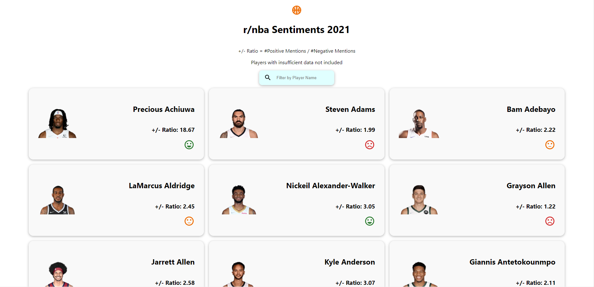
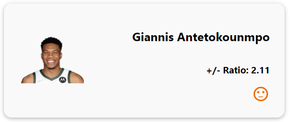
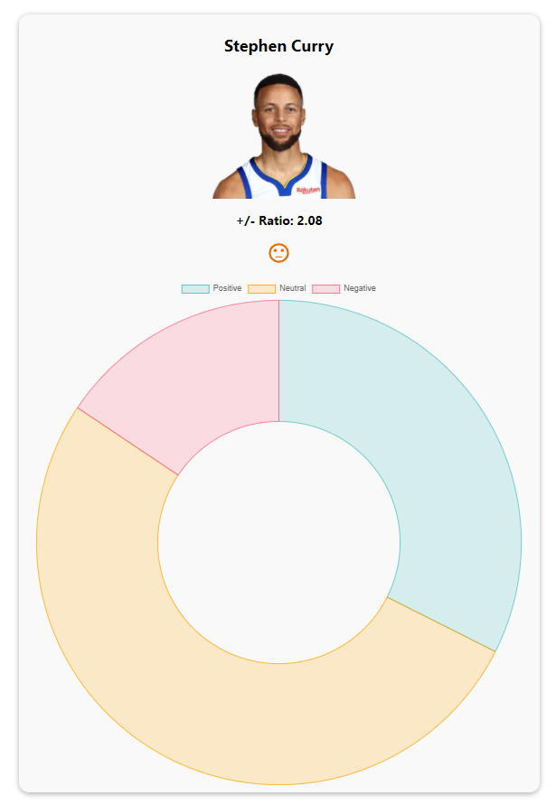

# NBA Subreddit Player Sentiment Analysis
This application compiles data from the r/nba subreddit and performs sentiment analysis on posts/comments for all active players for the 2021 NBA season. The web application displays the results along with doughnut charts to visualize the data.

URL: https://nba-sentiment-frontend.vercel.app/

## Table of Contents
1. [Introduction](#introduction)
2. [Code Overview](#codeoverview)
3. [Implementation Detail](#implementation)
    1. [Data Retrieval](#dataretrieval)
    2. [Sentiment Analysis](#sentimentanalysis)
    3. [Creating a Flask API](#api)
    4. [Making a Web App](#webapp)
    5. [Deploying the Web App](#deployingwebapp)
3. [Using the Application](#usingtheapplication)
4. [Evaluation of Results](#evaluation)
5. [Built With](#builtwith)

## Introduction <a name="introduction"></a>
The NBA has hundreds of players, along with millions of fans that have their own favorite players, as well as their own hated players. The NBA Subreddit provides insight on which players might be liked and which players might be disliked by the general community, as the subreddit has upwards of 4 million subscribers.

Through this project, my goal was to determine which players are the most liked/disliked in the NBA Subreddit community, by analyzing post titles and comments about individual players. After retrieving data and performing sentiment analysis, I created a web application that compiles and visualizes the results.

## Code Overview <a name="codeoverview"></a>
There are 4 main components to the code. First, I retrieved and cleaned the necessary data. Next, I performed sentiment analysis on the data. After getting the results, I created an API to expose the data for consumption, and lastly I created a frontend to display the results.

#### /backend/pushshift_scraper.py
This file retrieves reddit data through the PushShift Reddit API and stores the data in csv files. The code was divided as follows:
```python
ACTIVE_PLAYERS
YEARS
```
These are the constants that determine what data should be queried. The ACTIVE_PLAYERS list can be any list of strings. The YEARS list can be any list of years.

```python
class RedditScraper
```
This is the main class to connect to the PushshiftAPI and set parameters. An instance of this class represents a scraper that is linked to a given subreddit, with additional filters for time period and submission/comment limits.

```python
get_submission_titles(self, queries, year)
get_comments(self, queries, year)
```
These are the two main functions for retrieving data. The main process of both the functions is as follows: For each query (player name) perform the search. If any data was found, store it in a pandas dataframe, strip new line characters, and convert the dataframe to csv format.

#### /backend/sentiment_analyzer.py
This file performs sentiment analysis on the retrieved data using the NLTK library. The results were stored in a MongoDB database for later consumption by the frontend.
```python
ACTIVE_PLAYERS
YEARS
```
These are the constants that determine what data should be queried. The ACTIVE_PLAYERS list can be any list of strings. The YEARS list can be any list of years.

```python
read_file(file_name)
```
This function opens a given file with utf8 encoding and returns a list of its lines.

```python
clean_data(data)
```
This function takes a list of text data and strips non-alpha-numeric characters while also filtering out lines longer than 300 characters.

```python
analyze_titles()
analyze_comments()
```
These are the two main functions for analyzing the data. The main process of both the functions is as follows: For each csv file, first clean the data. Next, initialize the NLTK Sentiment Analyzer, and store the polarity scores in an array. Then, convert the scores array into a pandas dataframe in order to label the data. Lastly, counts of each label were determined and stored in a database.

#### /backend/api/app.py
The file initializes two API routes.
```
@app.route('/players', methods=['GET'])
@app.route('/players/<int:player_id>', methods=['GET'])
```
The first route returns every player document from the database.
The second route queries the database based on a specified player_id to return a single player document.

## Implementation Detail <a name="implementation"></a>
### Data Retrieval <a name="dataretrieval"></a>
For retrieving the data, I started with the Python Reddit API Wrapper (PRAW). However, I quickly discovered that not only was PRAW limited in terms of quantity of data that could be retrieved, but it was also extremely slow. Thus, I looked into additional options and found PushShift, which is an API that allows for searching reddit data with powerful aggregations. In tandem with PushShift Multithread API Wrapper (PMAW), the data retrieval process became a lot faster and more dynamic. 

However, retrieving high quality data proved to be difficult for a couple of reasons. First, some players shared first or last names. Second, posts and comments often either did not explicitly mention player names at all or mentioned multiple names together. I ultimately decided to query based on full names of players. Unfortunately, this was not the best option for specific players who frequently go by nicknames, but for the average player, this was sufficient.

As for parameters, I decided to limit the time range to 2021 data only. I also decided to only retrieve data on active players as of the current NBA season, with limits of up to 1000 post titles and 5000 comments per player (500+ players).

### Sentiment Analysis <a name="sentimentanalysis"></a>
For performing sentiment analysis, I started by cleaning the data, as a lot of the posts and comments contained irrelevant data such as links and emojis. I filtered these out using regular expressions. When cleaning the data, I also removed lines greater than 300 characters, as I found that some posts had long, pinned moderator comments that listed a lot of non-nba related text.

As for collecting the results, I opted to give each line a label of "neutral", "positive", or "negative". I decided on a threshold of [-0.2, 0.2] for labelling the data. I decided on this because I found that many scores that were slightly positive or slightly negative were relatively neutral. Data with a compound score below -0.2 would be negative, scores between the thresholds would be neutral, and scores above 0.2 would be positive.

### Creating a Flask API <a name="api"></a>
In order to then provide this data to a frontend, I created a simple Flask REST API. The API contains just two endpoints for getting data. I decided on one endpoint for returning all data, and one endpoint for returning a specific player's data. This way, I could use the first endpoint for a homepage displaying a list of players, and I could use the second endpoint to create individual payer pages. 

I deployed the api through heroku: https://nba-sentiments-api.herokuapp.com/

However, I found that the "inactive" state of APIs deployed on heroku's free tier created some difficulties, so I later altered my frontend implementation's way of fetching data.

### Making a Web App <a name="webapp"></a>
The final step of the project was building a frontend to display the data in a more user-friendly manner. I decided to use React.js/Next.js to make the application, as Next.js provides static generation as well as built-in page routing. This made it easy to create dynamic routes for each individual player page.

In terms of the application itself, there are a few key features. Every player is displayed on a "card", along with a decimal number. For the number, I decided to establish a positivity index calculated by (number of positives / number of negatives). I decided on this with YouTube's like/dislike ratio in mind. Based on the results, I then decided on thresholds of 3.0 and 2.0. Greater than 3.0 is positive, greater than 2.0 is neutral, and below that is negative. Each player "card" then routes to an individual player page, which most notably features a Doughnut chart visualizing the counts of each label (positive, neutral, negative). 

### Deploying the Web App <a name="deployingwebapp"></a>
I ran into many difficulties when trying to deploy my application. I initially used my Flask API on heroku to fetch data for my frontend. However, with Next.js and its static generation, my application was unable to build due to heroku's inactive "sleep" status for its free tier. When the API was in "sleep" mode, my frontend was not able to successfully retrieve a response. I then tried other deployment options, such as Google Cloud, to no avail.

Thus, I opted to query my database directly from my frontend. This way, I could guarantee quick access to the cloud-hosted data on MongoDB. With that issue solved, I was able to successfully deploy my app on Vercel.

## Using the Software <a name="usingtheapplication"></a>
#### Running the code locally
First, clone the repository like so.
```
git clone https://github.com/justynlao/CourseProject.git
```
Then, install dependencies.
For the back-end (python):
```
pip install -r requirements.txt
```
For the front-end (JavaScript, npm):
```
npm install
cd [the directory of the frontend]
npm run dev
```

#### Using the scraper/sentiment analyzer
The scraper and sentiment analyzer can both be altered and re-used to not only get more data from r/nba, but also get data from other subreddits. 
For the scraper, initialize a RedditScraper object with your parameters of choice. 
```python
scraper = RedditScraper([name of subreddit], before, after, [title_limit], [comment_limit])
```
Then, call the retrieval functions.
```python
scraper.get_submission_titles([query list], year)
scraper.get_comments([query list], year)
```
The sentiment analyzer requires changes to the file names to read the data from, then simply calling the two analyze functions.
```python
analyze_titles()
analyze_comments()
```

#### Using the Web Application
The web application is relatively simple, as it is moreso a visualization of data. The home page features a list of every single active player (excluding those with insufficient data). Each player card displays a picture, name, a positivity ratio, and an icon representing the positivity.


Each player card can be clicked on, which sends the user to an individual player page. 


The individual player pages include an additional Doughnut chart, visualizing the ratios of positive, negative, and neutral titles/comments. Hovering over sections of the chart also show the exact number of each.


## Evaluation of Results <a name="evaluation"></a>
As an active browser of the r/nba subreddit, I found that the Sentiment Analysis results for some players were more or less reasonable. Players like Patrick Beverly and Kyrie Irving having more negative mentions made sense to me, as Beverly has an infamous reputation for being scrappy and "dirty". Likewise, Kyrie Irving has been especially disliked in the last year with his avoidance of the covid vaccine. Star players like Stephen Curry, Lebron James, and Kevin Durant all being around average also made sense. Superstars, while well liked by their fans, also have many on the opposite spectrum. Whenever a star player has a bad game, haters rush in to make posts and comments.

Unfortunately, there were aspects of the analysis that fell short with regards to accuracy. Some player names themselves are words with positive sentiment, as evidenced by the results. Players like Kevin Love, the Holiday brothers, and Precious Achiuwa had extremely high positivity ratios due to their names. Titles and comments that would otherwise be neutral were rendered positive due to the positive connotation existing in the names, like "Love", "Holiday", and "Precious".

Furthermore, many of the lesser known players had very little data to go off of, so certain results were skewed due to sample size. A player like Keita Bates-Diop had a measely positivity ratio of 1.25, but there were also less than 30 data points to analyze.

## Built With <a name="builtwith"></a>
#### Backend
Library/Package | Version
--------------- | -------
|PMAW | 2.1.0 |
|Pandas | 1.3.2 |
|NLTK | 3.6.5 |
|PyMongo | 4.0 |
|Flask | 2.0.2 |

#### Frontend
Library/Package | Version
--------------- | -------
|React.js | 17.0.2 |
|Next.js | 12.0.7 |
|Axios | 0.24.0 |
|Chart.js | 3.6.2 |
|MUI | 5.2.3 |
|MUI Icons | 5.2.1 |


